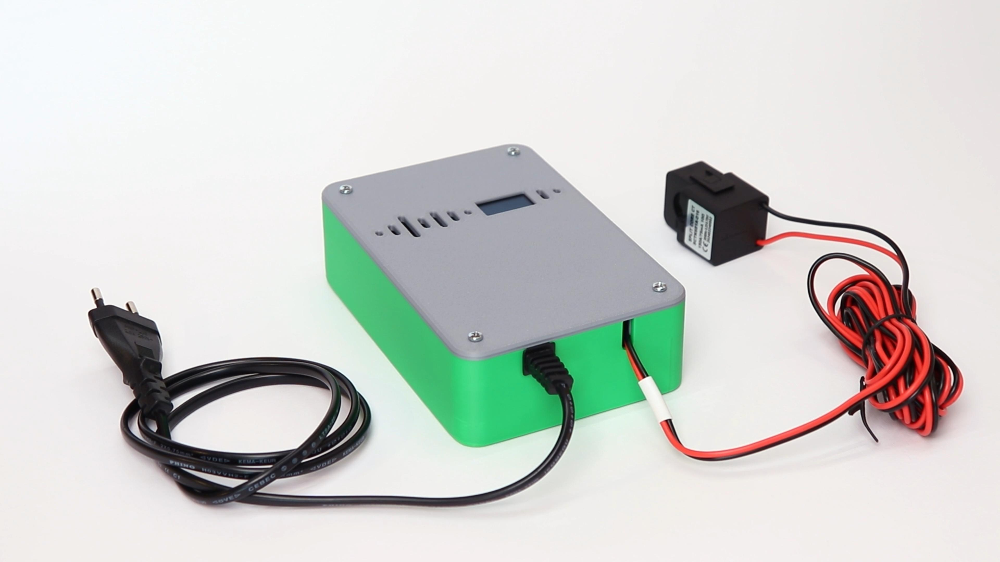

# ESP32 Smart Energy Meter with OLED Display



A DIY smart energy monitoring system based on ESP32 with ESPHome firmware, featuring real-time power monitoring, OLED display, and Home Assistant integration.

## ⚡ Overview

This project provides a comprehensive energy monitoring solution that measures AC power consumption in real-time. The system displays power, voltage, and current on a local OLED screen while simultaneously sending data to Home Assistant for detailed analytics and automation.

### Key Features

- **Dual Channel Monitoring**: Monitors two separate electrical circuits
- **Real-time Display**: 128x64 OLED display with WiFi status indicator
- **Home Assistant Integration**: Seamless integration with energy dashboards
- **OLED Burn-in Protection**: Automatic screen clearing to prevent display damage
- **Enhanced WiFi Status**: Accurate connectivity monitoring using signal strength
- **Professional Fonts**: Google Fonts integration for clean, readable display
- **Modbus Communication**: Reliable RS485 communication with JSY energy meters

## 🏗️ Original Project Attribution

This project is based on the excellent work by **Giovanni Aggiustatutto** and his original Instructable:

**Original Project**: [DIY Smart Energy Meter With ESP32 + Home Assistant](https://www.instructables.com/DIY-Smart-Energy-Meter-With-ESP32-Home-Assistant/)  
**Author**: Giovanni Aggiustatutto  
**License**: Creative Commons Attribution-NonCommercial-ShareAlike (BY-NC-SA 4.0)

The original project provided the foundation for this enhanced version, which adds several improvements including:
- Enhanced WiFi connectivity monitoring
- OLED burn-in protection
- Improved display formatting
- Optimized update intervals

## 📋 Hardware Requirements

### Main Components
- **ESP32 Wemos D1 Mini** (recommended - compact ESP32 development board)
- **JSY-MK-194G Energy Meter** with Modbus RTU over RS485
- **SSD1306 128x64 OLED Display** (I2C)
- **RS485 to TTL Converter Module** (for Modbus communication)
- **Meanwell APV-8-5 5V 8W Power Supply** (for system power)

### Optional Components
- **3D Printed Enclosure** (see hardware guide)
- **Current Clamps** (for non-invasive monitoring)
- **Voltage Transformers** (if needed for voltage measurement)

### Wiring Requirements
- **UART Pins**: TX (GPIO17), RX (GPIO16)
- **I2C Pins**: SDA (GPIO21), SCL (GPIO22)
- **Power Supply**: 5V external supply to ESP32 +5V pin, ESP32 3.3V powers all peripherals

## 🔧 Installation & Setup

### 1. Hardware Assembly

Refer to our detailed [Hardware Guide](docs/hardware-setup.md) for complete assembly instructions.

### 2. ESPHome Configuration

1. **Install ESPHome**:
   ```bash
   pip install esphome
   ```

2. **Configure Secrets**:
   Create a `secrets.yaml` file:
   ```yaml
   wifi_ssid: "YOUR_WIFI_SSID"
   wifi_password: "YOUR_WIFI_PASSWORD"
   ```

3. **Upload Configuration**:
   ```bash
   esphome run esp32-energy-meter.yaml
   ```

### 3. Home Assistant Integration

1. **Auto-Discovery**: ESPHome devices are automatically discovered by Home Assistant
2. **Manual Addition**: If auto-discovery fails, use ESP32's IP address
3. **Energy Dashboard**: Add sensors to your Home Assistant energy configuration

## 📊 Monitored Parameters

### Channel 1 & Channel 2
- **Voltage** (V) - Line voltage measurement
- **Current** (A) - Current flow measurement  
- **Power** (W) - Real-time power consumption
- **Energy** (kWh) - Total energy consumption
- **Power Factor** - Power quality indicator
- **Frequency** (Hz) - AC line frequency

### System Monitoring
- **WiFi Signal Strength** (dBm) - Network connectivity quality
- **Connection Status** - Binary connectivity indicator
- **Device Uptime** - System reliability monitoring

## 🔄 Enhanced Features

### OLED Display Features
- **Real-time Power Display**: Large, easy-to-read power readings
- **WiFi Status Indicator**: Visual connection status with signal strength
- **Burn-in Protection**: Automatic screen clearing every 30 minutes
- **Professional Typography**: Google Fonts for clean appearance
- **Rotated Display**: 180° rotation for optimal viewing angle

### WiFi Connectivity Improvements
- **Signal Strength Monitoring**: Accurate WiFi quality assessment
- **Connection Threshold**: Configurable signal strength threshold (-70 dBm)
- **False Positive Elimination**: No more spurious disconnection alerts

### Performance Optimizations
- **Optimized Update Intervals**: 3-second sensor updates for responsive monitoring
- **Modbus Command Throttling**: Efficient communication with energy meters
- **Memory Management**: Optimized font loading and display rendering

## 🏠 Home Assistant Integration

### Auto-Discovery
The device automatically appears in Home Assistant and all sensors are ready for use.

### Energy Dashboard Setup
```yaml
# Add to your energy configuration
power:
  - sensor.esp32_energy_meter_power_2
voltage:
  - sensor.esp32_energy_meter_voltage_2  
current:
  - sensor.esp32_energy_meter_current_2
energy:
  - sensor.esp32_energy_meter_energy_2
```

### Automation Examples
- **Power Alerts**: Notify when power exceeds thresholds
- **Usage Analytics**: Daily/weekly energy consumption reports
- **Device Control**: Automatically control appliances based on consumption

## 📖 Documentation

- **[Hardware Setup Guide](docs/hardware-setup.md)** - Complete assembly instructions
- **[Configuration Guide](docs/configuration-guide.md)** - ESPHome configuration tutorial
- **[Home Assistant Integration](docs/Home-Assistant-Integration.md)** - HA setup and usage
- **[Troubleshooting](docs/troubleshooting.md)** - Common issues and solutions
- **[API Reference](docs/api-reference.md)** - Complete sensor documentation
- **[Advanced Features Guide](docs/Advanced-Features.md)** - Advanced customization options

## ⚠️ Safety Warning

⚠️ **HIGH VOLTAGE**: This project involves working with mains electricity. Always disconnect power before making connections and use appropriate safety measures. The authors are not responsible for any damage or injury resulting from the use of this project.

## 📜 License

This project is licensed under the **Creative Commons Attribution-NonCommercial-ShareAlike 4.0 International License**.

### What you can do:
- ✅ **Use**: Use the project for personal, non-commercial purposes
- ✅ **Share**: Share the project with others
- ✅ **Adapt**: Modify and build upon the project
- ✅ **Credit**: Give appropriate credit to the original authors

### What you cannot do:
- ❌ **Commercial Use**: Use for commercial purposes without permission
- ❌ **Exclusive Licensing**: Apply additional restrictions that would limit the original license

### What you must do:
- 📋 **Attribution**: Give credit to Giovanni Aggiustatutto and this project
- 📋 **Share-Alike**: License derivatives under the same terms

## 🙏 Acknowledgments

- **Giovanni Aggiustatutto** - Original project concept and implementation
- **ESPHome Community** - Excellent firmware and documentation
- **Home Assistant Community** - Platform and integration support
- **JSY Energy Meter Manufacturer** - Hardware specifications

## 📞 Support

- **Issues**: [GitHub Issues](https://github.com/your-repo/esp32-energy-meter/issues)
- **Discussions**: [GitHub Discussions](https://github.com/your-repo/esp32-energy-meter/discussions)
- **Documentation**: [Project Wiki](https://github.com/your-repo/esp32-energy-meter/wiki)

---

**Made with ❤️ for the DIY Energy Monitoring Community**

*This project promotes energy efficiency and helps users understand their consumption patterns for a more sustainable future.*
